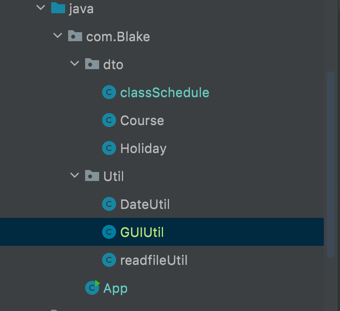
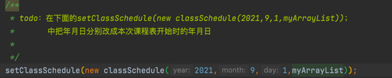
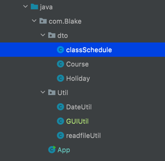
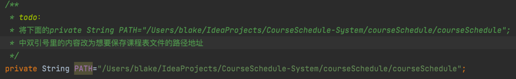
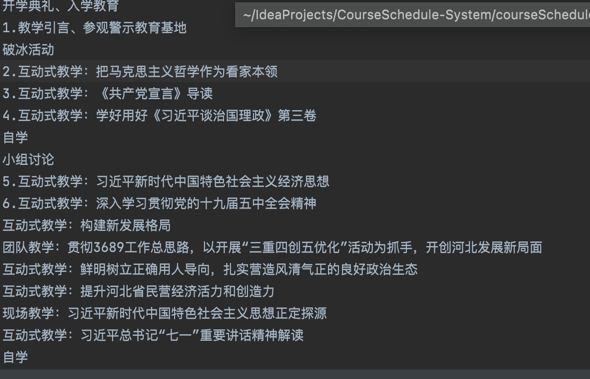
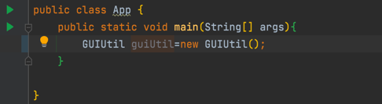
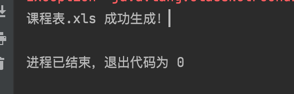

# 操作步骤
1. 找到GUIUtil的文件  
   
2. 在GuiUtil中找到标注的todo并按指示填入年月日  

3. 找到classSchedule文件

4. 在classSchedule中找到标注的todo并按指示修改修改路径

5. 找到App  

6. 将已经编辑好的课程文本复制

7. 在App中点击最左侧的绿色三角箭头启动程序  

8. 看到弹出的窗口，并在窗口中将复制好的文本粘贴，并点击回车键

9. 看到下方控制台输出"课程表.xls 成功生成！"即可

10. 然后去刚才第四步中自己设置的路径中找到课程表文件即可